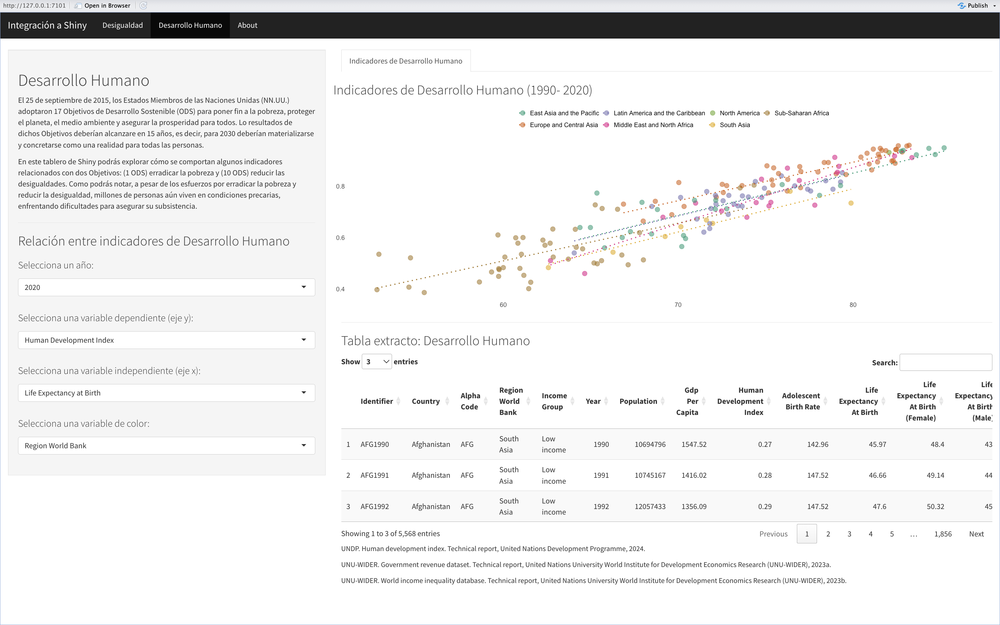

```{r setup, include=FALSE}
knitr::opts_chunk$set(echo = FALSE)
```

\vspace{100pt}

# Introducción

## Objetivos de Desarrollo Sostenible: (1) fin de la pobreza y (10) reducción de las desigualdades

El 25 de septiembre de 2015, los Estados Miembros de las Naciones Unidas (NN.UU.) adoptaron 17 Objetivos de Desarrollo Sostenible (ODS) para poner fin a la pobreza, proteger el planeta, el medio ambiente y asegurar la prosperidad para todos. Lo resultados de dichos Objetivos deberían alcanzare en 15 años, es decir, para 2030 deberían materializarse como una realidad para todas las personas. @un1

A medida que nos acercamos al plazo definido por las NN.UU., es crucial analizar el progreso realizado y tomar acciones encaminadas al cumplimiento de los 17 ODS. En este sentido, presento el tablero de `Shiny` *Desigualdad y Desarrollo Humano*, en el que se exploran el comportamiento de indicadores relacionados con los Objetivos: (1 ODS) erradicar la pobreza y @un2 (10 ODS) reducir las desigualdades @un3. ^[Estos objetivos se consideran fundamentales para el desarrollo sostenible y el bienestar de las personas, ya que facilitan el acceso a determinantes de desarrollo como alimentos, vivienda digna y de calidad, educación y atención médica.]

## Tablero de `Shiny` sobre Desigualdad y Desarrollo Humano

En el tablero se explora el comportamiento del Coeficiente de Gini, el principal indicador de desigualdad por ingreso, para más de 190 países de 1950 a 2022. Además, se presentan indicadores de desigualdad de género, como el Índice de Desarrollo de Género y el Índice de Desigualdad de Género. Para el análisis de desigualdad por género se incluyeron datos de desigualdad política. 

En una segunda pestaña se presentan indicadores de desarrollo humano, como el Producto Interno Bruto per cápita, la esperanza de vida al nacer y la tasa de mortalidad materna. Para esta sección, el usuario podrá interactuar construyendo sus propias visualizaciones al seleccionar las variables que sean de su interés.

- Las visualziaciones contendias en este reporte corresponden a las que se presentan en el Tablero *Desigualdad y Desarrollo Humano*.

## Fuentes de datos

Para el proyecto se utilziará el dataset *Human Development Index* del Programa de las Naciones Unidas para el Desarrollo @hri_cite, y los conjuntos de datos *World Income Inequality Database* y *Government Revenue Dataset*, ambos del Instituto Mundial de Investigación sobre Economía del Desarrollo de la Universidad de las Naciones Unidas @wiid_cite y @grd_cite. Estos tres dataset contienen información relevante sobre desarrollo humano, pobreza y desigualdad a lo largo del tiempo para más de 190 países y territorios.

```{r, warning = FALSE, message = FALSE, fig.align = "center", results = FALSE, out.width = "9cm"}
# Cargar librerías

library(ggplot2)
library(dplyr)
library(sf)
library(rnaturalearth)
library(patchwork)
library(stargazer)
library(tidyr)
library(RColorBrewer)
library(forcats)
library(ggcorrplot)

dir("dataset")

# Cargar bases de datos

grd <- read.csv("dataset/grd.csv")
colnames(grd)

hdi <-  read.csv("dataset/hdi.csv")
colnames(hdi)

wiidglobal <- read.csv("dataset/wiidglobal.csv")
colnames(wiidglobal)

new_Data <- left_join(wiidglobal, grd, by = c("identifier", "iso3", 
                                              "country", "year"))

new_Data <- left_join(new_Data, hdi, by = c("identifier", "iso3", 
                                            "country", "year"))

new_Data <- new_Data  %>% 
  filter(year >= 1950) %>% 
  filter(identifier != "Area")

develop_data <- new_Data %>%
  select(c(identifier, country, iso3, region_wb, incomegroup, year, population, gdp, # Datos país
           gini, ginia, coef_ineq, ineq_inc, ihdi, bottom5, bottom20, bottom40, middle50, top20, top10, top5, top10, # Datos desigualdad
           gdi, gii, hdi_f, hdi_m, pr_f, pr_m, # Datos genero
           hdi, abr, le, le_f, le_m, mmr, mys, mys_f, mys_m)) # Datos desarrollo humano

new_Data <- new_Data %>%
  relocate(year, .before = iso3) %>% 
  relocate(region, .after = iso3) %>% 
  relocate(subarea, .after = region) %>% 
  relocate(region_wb, .after = subarea) %>% 
  relocate(incomegroup, .after = region_wb) %>% 
  relocate(population, .after = incomegroup) %>% 
  relocate(gdp, .after = population) %>%
  relocate(identifier, .before = country)

world <- new_Data
```

# Desigualdad ^[En la primera página del tablero se presentan datos de desigualdad por ingreso y por género. Los controles laterales habilitan la interactividad para el usuario.]

## Desigualdad por ingreso: Coeficiente de Gini a nivel regional (Serie 1950- 2020) ^[El Tablero permite seleccionar cualquier región.]

A continuación se presenta cómo ha evolucionado la desigualdad de ingresos en diferentes regiones del mundo desde 1950 hasta 2020 medida por el Coeficiente de Gini.^[El Coeficiente es una medida para estimar la desigualdad en los ingresos dentro de un país y se computa como una variable entre 0 y 1, donde 0 se corresponde con la perfecta igualdad y 1 se corresponde con la perfecta desigualdad.]

\vspace{15pt}

```{r, warning = FALSE, message = FALSE, fig.align = "center", results = FALSE, out.width = "10.5cm"}
wiidglobal %>%
  filter(subarea %in% c("South Asia",
                        "East Asia and the Pacific",
                        "Latin America and the Caribbean",
                        "Middle East and North Africa",
                        "Sub-Saharan Africa",
                        "Europe and Central Asia",
                        "North America")) %>% 
  ggplot(aes(year, gini,
             group = subarea, colour = subarea)) + 
  geom_line(size = .8) +
  theme_minimal() +
  labs(title = "Coeficiente de Gini por región",
       subtitle = "Serie 1950 - 2022",
       y = "Coeficiente de Gini",
       x = "") +
  scale_color_brewer(palette = "Set2", name = "") +
  theme(legend.position = "top") +
  scale_x_continuous(breaks = seq(min(wiidglobal$year), max(wiidglobal$year), by = 5))
```

### Desigualdad por ingreso: Coeficiente de Gini en regiones seleccionadas (Serie 1950- 2020)

Con mayor detalle, se puede extraer, por ejemplo, que Asia Oriental y el Pacífico, así como África Subsahariana, han registrado una marcada y constante disminución desde principios del siglo, mientras que Norteamérica y Asia Meridional muestran una tendencia ascendente en el indicador desde finales del siglo XX.

\vspace{15pt}

```{r, warning = FALSE, message = FALSE, fig.align = "center", results = FALSE, out.width = "10.5cm"}
subarea_colors <- c("South Asia" = "#FFD92F",
                    "East Asia and the Pacific" = "#66C2A5",
                    "Latin America and the Caribbean" = "#8DA0CB",
                    "Middle East and North Africa" = "#E78AC3",
                    "Sub-Saharan Africa" = "#E5C494",
                    "Europe and Central Asia" = "#FC8D62",
                    "North America" = "#A6D854")

wiidglobal %>%
  filter(subarea %in% c("South Asia",
                        "East Asia and the Pacific",
                        "Middle East and North Africa",
                        "Sub-Saharan Africa",
                        "Europe and Central Asia",
                        "North America")) %>% 
  ggplot(aes(year, gini,
             group = subarea, col = subarea)) + 
  geom_line(size = .8) +
  theme_minimal() +
  labs(title = "Coeficiente de Gini por región",
       subtitle = "Serie 1950 - 2022",
       y = "Coeficiente de Gini",
       x = "") +
  theme(legend.position = "none") +
  facet_wrap(~subarea, scales = "free_y", dir = "v", ncol = 3) +
  scale_color_manual(values = subarea_colors, name = "")
```

### Desigualdad por ingreso: Coeficiente de Gini a nivel país (2022)

Se presenta el mapa del Coeficiente de Gini a nivel país para el año 2022. Como se puede identificar, la regón de África Subsahariana, así como la región de Asia Meridional, son las regiones más desiguales del mundo.

\vspace{15pt}

```{r, warning = FALSE, message = FALSE, fig.align = "center", results = TRUE, out.width = "11cm"}

```

## Distribución del ingreso nacional ^[En el tablero se puede seleccionar el año y región para la gráfica.]

Se presenta la distribución del porcentaje de participación del ingreso nacional entre diferentes grupos de la población. Lo anterior permite analizar la desigualdad en la distribución del ingreso entre diferentes percentiles. Del gráfico podemos observar que, a nivel global, el *Top 5* de las personas mejor remuneradas concentraron ~23% del ingreso (promedio entre países). Lo anterior, da muestra de una marcada desigualdad entre la población. Por otro lado, los percentiles inferiores muestran una participación significativamente menor en el ingreso nacional. Por ejemplo, el *Bottom 5* apenas alcanza un promedio del 0.5% del ingreso. Esta diferencia resalta la concentración del ingreso en los segmentos superiores de la población.

\vspace{15pt}

```{r, warning = FALSE, message = FALSE, fig.align = "center", results = FALSE, out.width = "9cm"}
# Gráficas de sumarización
new_Data <- new_Data %>% 
  select(c(identifier, country, year,
           population, gdp, gini, bottom5, bottom20, bottom40, top5, top10, top20, middle50,
           abr, gdi, gii, hdi, le, mmr, pr_f, pr_m))
  
new_Data <- pivot_longer(data = new_Data,
               cols = population:pr_m,
               names_to = "variable",
               values_to = "data")
```

```{r, warning = FALSE, message = FALSE, fig.align = "center", results = FALSE, out.width = "10.5cm"}
# Distribución del ingreso
new_Data %>%
        filter(variable %in% c("bottom5", "bottom20", "bottom40",
                               "top5", "top10", "top20", "middle50")) %>%
        mutate(variable = factor(variable, 
                                 levels = c("bottom5", "bottom20", "bottom40", "middle50",
                                            "top20", "top10", "top5")) %>% 
                 fct_recode("Bottom 5" = "bottom5", 
                            "Bottom 20" = "bottom20",
                            "Bottom 40" = "bottom40",
                            "Middle 50" = "middle50",
                            "Top 20" = "top20",
                            "Top 10" = "top10",
                            "Top 5" = "top5")) %>%
        filter(year == 2022) %>%       
        ggplot(aes(variable, data)) + 
        geom_jitter(fill = "lightgrey", color = "lightgrey", alpha = 0.3) +
        geom_boxplot(fill = "#8DA0CB", color = "royalblue4", alpha = 0.5) + 
        ylim(0, 100) +
        theme(axis.text.x = element_text(angle = 90, vjust = 0.5, hjust = 1)) +
  labs(title = "Participación en el ingreso nacional",
       subtitle = "Porcentaje de participación entre diferentes percentiles",
       y = "%",
       x = "") +
  theme_minimal()
```
\vspace{15pt}

## Desigualdad por género

Se presenta la densidad de la evaluación de más de 190 países para el año 2020 en los indicadores Índice de Desarrollo de Género (IDG), Índice de Desigualdad de Género (GII) e Índice de Desarrollo Humano en Mujeres. De la gráfica se extrae que se ha alcanzado un alto desarrollo humano entre hombres y mujeres (IDG)^[Valores cercanos a 1 implican una alta igualdad de desarrollo humano; valores menores implican menor IDH para las mujeres.]. 

Sin embargo, la variabilidad en los datos para el Índice de Desigualdad de Género (GII)^[El GII refleja la desigualdad basada en género en tres dimensiones: salud reproductiva, empoderamiento y mercado laboral. Los valores cercanos a 0 reflejan una alta igualdad,valores cercanos a 1 indican una alta desigualdad en todas las dimensiones medidas.] indica que persiste la desigualdad, con muchos países registrando altos niveles y con otros que han alzandado un alto grado de igualdad. Por otro lado, el IDH en Mujeres muestra una distribución muy variada, con una tendencia hacia valores medios y altos, reflejando diferencias significativas en el desarrollo humano entre hombres y muejres.

\vspace{15pt}

```{r, warning = FALSE, message = FALSE, fig.align = "center", results = FALSE, out.width = "10.5cm"}
new_Data %>%
  filter(variable %in% c("gdi", "gii", "hdi")) %>% 
  filter(year == 2020) %>% 
  ggplot(aes(data, fill = variable)) + 
        geom_density(size = 0.4, alpha = 0.35, color = "white") + 
  theme_minimal() +
  theme(legend.position = "top") +
  labs(title = "Distribución de Índices de desarrollo",
       y = "Densidad",
       x = "") +
  scale_x_continuous(breaks = seq(0, 1, by = .1)) +
  scale_fill_manual(values = c("gdi" = "#FC8D62", "gii" = "#66C2A5", "hdi" = "#8DA0CB"), 
                     name = "", labels = c("Índice de Desarrollo de Género",
                                           "Índice de Desigualdad de Género",
                                           "Índice de Desarrollo Humano"
                      )
            ) # +
  # guides(fill = guide_legend(ncol = 1))
```

## Desigualdad de género en participación política

Se presenta la serie histórica sobre el porcentaje de asientos ocupados en el Parlamento por hombres y mujeres.

\vspace{15pt}

```{r, warning = FALSE, message = FALSE, fig.align = "center", results = FALSE,  out.width = "10cm"}
library(ggrepel)

gender <- new_Data %>% 
  filter(variable %in% c("pr_f")) %>% 
  filter(year >= 1990) %>% 
  filter(data >= 50)

gender_text <- gender %>% 
  filter(year >= 2020)

new_Data %>%
  filter(year >= 1990) %>% 
  filter(variable %in% c("pr_f", "pr_m")) %>%
  group_by(variable, year) %>%
  summarise(data = mean(data, na.rm = T)) %>%
  ggplot(aes(x = year, y = data, group = variable, color = as.factor(variable))) + 
  geom_line(size = 1, size = 2) +
  geom_jitter(data = new_Data %>% 
               filter(variable %in% c("pr_f", "pr_m")) %>% 
               filter(year >= 1990),
             aes(x = year, y = data), alpha = 0.05) +
  theme_minimal() +
  labs(title = "Porcentaje de asientos ocupados en el parlamento por hombres y mujeres",
       subtitle = "Serie 1990 - 2022 | Promedio a nivel global",
       y = "Porcentaje de asientos ocupados",
       x = "") +
  # scale_color_brewer(palette = "Set2", name = "") +
  scale_x_continuous(breaks = seq(1990, 2022, by = 2)) +
  theme(legend.position = "top") +
  scale_color_manual(values = c("pr_f" = "#8DA0CB", "pr_m" = "#66C2A5"), 
                     name = "", labels = c("Porcentaje de Mujeres", "Porcentaje de Hombres"))
```
\vspace{15pt}

La línea muestra la tendencia a nivel global (promedio de países), mientras que el marcador de los puntos las observaciones a nivel país. Con los datos se puede apreciar una ligera disminución del porcentaje de asientos ocupados por hombres, así como un aumento en los ocupados por mujeres desde 1990 hasta 2020. Sin embargo, para la serie 1990 - 2022, solamente 5 países o territorios registran una participación de mujeres en el Parlamento mayor o igual a 50%, a saber, Andorra, Cuba, Nicaragua, Ruanda y los Emiratos Árabes Unidos.

# Desarrollo Humano 

En la segunda página del tablero se presentan en los controles un listado de indicadores de desarrollo humano para que el usuario pueda construir la visualización que sea de su interés. En este sentido, se presenta un ejemplo de las visualizaciones que podría construir el usuario final. En la gráfica se presenta la relación entre la tasa de mortalidad materna y la esperanza de vida al nacer para diferentes países en 2020.

\vspace{15pt}

```{r, warning = FALSE, message = FALSE, fig.align = "center", results = FALSE, out.width = "9cm"}
develop_data %>%
        filter(year == 2020) %>% 
        ggplot(aes(x = le, 
                   y = mmr,
                   color = incomegroup)) +
        geom_point(alpha = 0.6, size = 4) +
        scale_color_brewer(palette = "Dark2", name = "") +
        geom_smooth(method = "lm", se = F, alpha = 0.8, linetype = "dotted") +
        theme(legend.position = "top") +
        guides(fill = guide_legend(ncol = 2)) +
  theme_minimal() +
  theme(legend.position = "top") +
  labs(x = "Life Expectancy at Birth",
       y = "Maternal Mortality Ratio")
```

# Conclusiones 

El análisis de desigualdad y desarrollo humano realizado revela que, a pesar de los esfuerzos globales para erradicar la pobreza y reducir las desigualdades, la desigualdad por ingreso ingresos sigue estando presente en muchas regiones y subgrupos poblacionales. Por ejemplo, en términos poblacionales, se observa una marcada concentración del ingreso en los segmentos superiores de la población. 

En cuanto a la desigualdad de género, aunque se ha logrado un progreso en beneficio para las mujeres, la disparidad persiste en muchos países. Por ejemplo, la participación política de las mujeres sigue siendo insuficiente, con solo unos pocos países alcanzando una paridad en los asientos parlamentarios. Esto limita la capacidad de las mujeres para influir en las decisiones políticas y económicas que afectan sus vidas y el desarrollo de sus comunidades. En este sentido, la persistente desigualdad de género, junto con las profundas desigualdades de ingreso, subraya la necesidad de redoblar esfuerzos para cumplir con los Objetivos de Desarrollo Sostenible para 2030, asegurando que los beneficios del desarrollo se distribuyan de manera más equitativa y que todos los individuos tengan la oportunidad de alcanzar su pleno potencial.

Sobre lo relacionado con el desarrollo humano, se destaca que es necesario comprender cómo se relacionan los principales indicadores de desarrollo a fin de tomar decisiones basadas en evidencia. Analizar indicadores como el Producto Interno Bruto (PIB) per cápita, la esperanza de vida al nacer y la tasa de mortalidad materna nos podrían permitir evaluar el progreso en torno a los ODS, así como las regiones que requieren atención.

# Tablero de `Shiny`

```{r, warning = FALSE, message = FALSE, fig.align = "center", results = TRUE, out.width = "16cm"}

```

\vspace{10pt}

```{r, warning = FALSE, message = FALSE, fig.align = "center", results = TRUE, out.width = "16cm"}

```

\vspace{10pt}

```{r, warning = FALSE, message = FALSE, fig.align = "center", results = TRUE, out.width = "15cm"}

```